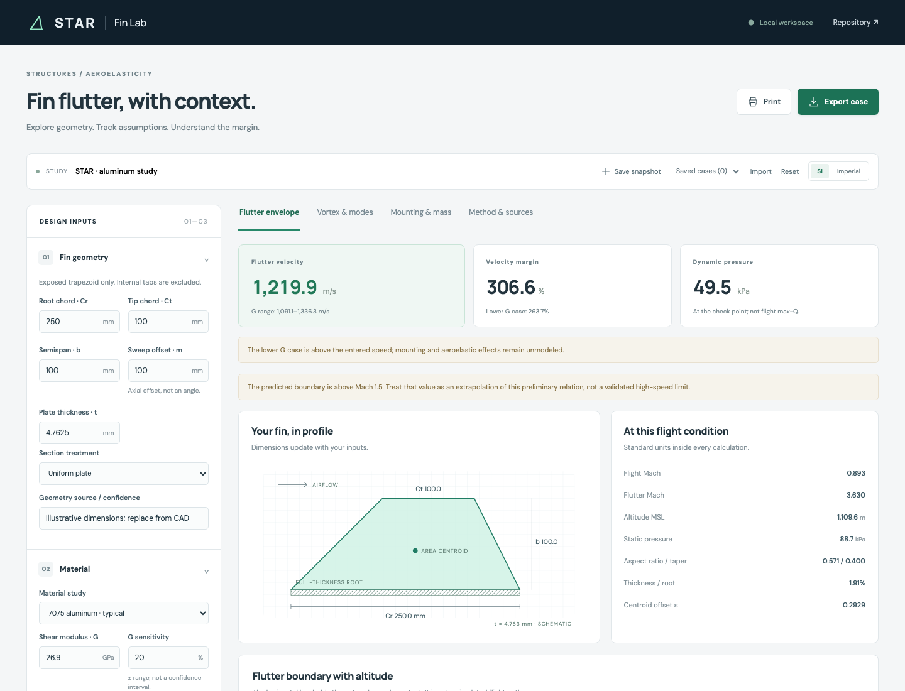

# STAR Fin Lab

A browser-based calculator for early fin design studies: plate flutter, paired flight-trajectory conditions, vortex-frequency screening, and root-support / aft-mass considerations.



## Run it

Requires Node.js 22 or newer.

```sh
npm ci
npm run dev
```

Open the local URL printed by Vite (usually http://127.0.0.1:5173).

```sh
npm run check       # engineering regression tests and production build
npx playwright install chromium webkit
npm run test:e2e    # desktop/mobile, Chromium and WebKit browser tests
npm run build      # static website in dist/
npm run preview    # serve the production build locally
```

The app has no backend or account requirement. Inputs stay in browser memory; saved snapshots use localStorage on that browser and origin. JSON export/import transfers a complete case, including assumptions and an optional trajectory. No case data is sent to a server. Google Fonts is an optional external font request; system fonts are the fallback.

### Saving and recovering a study

- Use **Save snapshot** before leaving or refreshing; the working form is not autosaved. The latest 12 snapshots are retained. Export JSON for a durable backup or sharing.
- Hybrid/custom studies with an unknown shear modulus can be saved and imported. Flutter results remain paused until G is supplied; no default modulus is silently substituted.
- Invalid inputs pause the affected results while retaining correction controls. Modes and mass tools do not require a known G. Mass is also independent of the flutter relation's centroid-validity limit.
- A rejected import leaves the current study unchanged. JSON requires the complete v1 input schema, preventing partial cases from silently acquiring CAD defaults or source claims. CSV supports quoted fields and decimal/scientific notation; multiline quoted fields are rejected.
- **Print** prints the current analysis view with its inputs. It is not a full multi-view engineering report.

## Use the calculator

1. Start from the [current CAD baseline](docs/CAD_BASELINE.md): 20 in root, 8 in tip, 8 in semispan and 6 in leading-edge sweep offset. Confirm the outline matches the installed **exposed** fin: root chord excludes internal tabs and semispan begins at the airframe outer surface. Sweep is measured parallel to the rocket axis, not along the slanted edge. Nominal 3/16 in thickness is retained; optimization is deferred.
2. Supply a sourced **shear modulus**, not Young's modulus. SI inputs use mm and GPa; imperial inputs use inches and Msi. Units convert without changing canonical SI data.
3. Enter airspeed and its corresponding AGL altitude, plus launch elevation MSL. Apogee is context, not the altitude at maximum speed. The 2,000-ft site assumption and 7,000-ft apogee target come from the project discussion; default flight-point values remain demonstrations, not released LE4 parameters. Do not use the apogee as the check altitude unless the speed being evaluated actually occurs there.
4. Review nominal and lower/upper-G flutter estimates. A sensitivity percentage is not statistical confidence or a bound on all model errors.
5. Import a trajectory to find the minimum **sampled** lower-G velocity margin. All imported rows use paired speed/altitude. No interpolation or flight dynamics simulation is performed.
6. In **Vortex & modes**, enter a geometry/flow-specific f-based Strouhal correlation and assembly modal frequencies. Do not infer these modes from the flutter formula. A frequency-band crossing is not a failure or flutter prediction.
7. In **Mounting & mass**, document the actual load path. Additional mass must include tabs, epoxy, extra skins and hardware if absent from the plate model. CG baseline must exclude the entire added assembly to avoid double counting.

### CSV format

```csv
time_s,altitude_agl_m,speed_m_s
0,0,0
1,30,60
2,150,180
3,400,300
```

These rows are illustrative only. Supported headers also include OpenRocket-style `Time (s),Altitude (m),Total velocity (m/s)` (including a `#` header prefix), with additional columns ignored. Verify that the exported velocity is **air-relative** for your simulation and wind setting; rename/recompute as necessary. Ground/vertical velocity must not be substituted. Imperial CSV headers and vertical-velocity headers are intentionally rejected. Limits: 2 MB, 10,000 rows, strictly increasing times. Exported evaluated CSV includes flutter bands, point margins, q and Mach.

### Model boundaries

- Uniform, thin, isotropic trapezoidal plate approximation; triangles can use tip chord = 0. The default relation applies Bennett's geometric-centroid correction. A fixed-epsilon Martin comparison is selectable.
- Bevels, airfoils, taper, nonuniform density, hybrid laminates, root flexibility, fillets, struts and fastener slip are **not** solved. Their selection is recorded without silently changing the physics.
- No `G × 2` shortcut for tip-to-tip reinforcement. Hybrid/custom materials require user-supplied G.
- Tropospheric atmosphere only, up to 11 km MSL. Local atmosphere uses **station absolute pressure**, not sea-level-corrected weather pressure.
- No strength, adhesive failure, laminate failure, flutter certification, FAR compliance or launch approval is inferred. A value beyond Mach 1.5 is explicitly flagged as extrapolation.

## Sources and verification

See [docs/METHODS.md](docs/METHODS.md) for equations, source links, assumptions and benchmark provenance. Reference interaction: [Rocketry Forum calculator](https://www.rocketryforum.com/rocket-calculators/fin-flutter/). The UI and implementation are original, not copied from the reference site.

The numerical regression is tied to [John K. Bennett's v1.3 workbook](https://github.com/jkb-git/Fin-Flutter-Velocity-Calculator/tree/ef5e50aeb72df2f19b5b9b08d9269467c83af76c). CI runs the regression tests, builds the app, and exercises the browser controls.

## Hosting

`dist/` is a static website that can be served by any static host, including at a subdirectory. Making this repository public does not deploy a hosted website: the local preview still binds only to localhost. Do not put credentials in exported cases. To expose the app on a local network, intentionally choose an appropriate Vite host binding.
